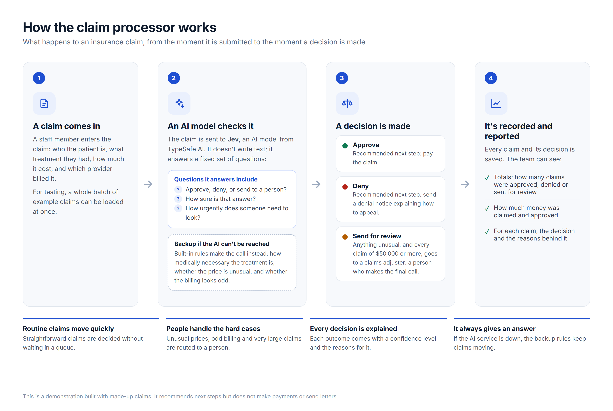
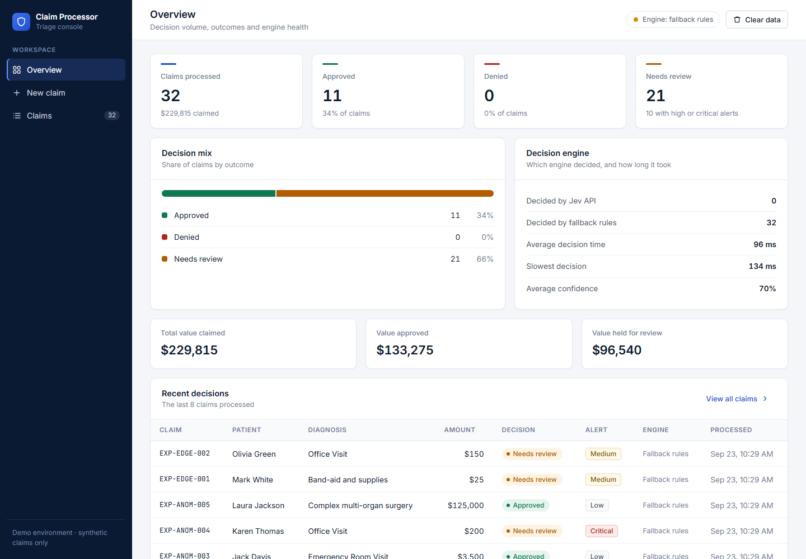
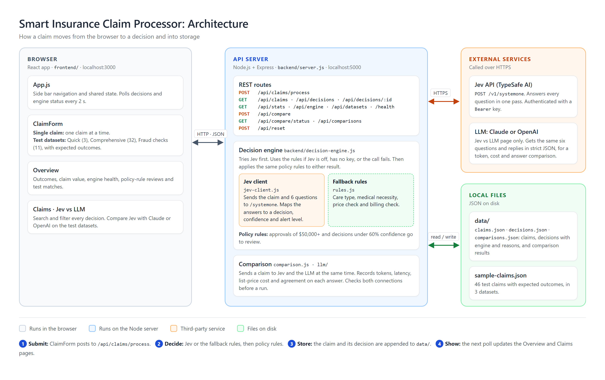

# Smart Insurance Claim Processor

[](https://github.com/akhilkoduriak/jev-claim-processor/actions/workflows/ci.yml)

A claim triage console. Each insurance claim is approved, denied or sent to a person for review, with a confidence level and the reasons behind the decision. Decisions come from TypeSafe AI's **Jev** model, with built-in rules as a backup when Jev can't be reached.

This is a demo that runs on made-up claims. It recommends next steps but does not make payments or send letters.

## How it works



A plain-language overview for non-technical readers. The source is [docs/how-it-works.html](docs/how-it-works.html).



## Quick start

Requires Node.js 22 or later (24 recommended).

```bash
npm run install-all   # installs root, backend and frontend packages
npm run dev           # starts the API on :5000 and the app on :3000
```

Open http://localhost:3000. To use Jev, copy `backend/.env.example` to `backend/.env`, add your key (see [Configuration](#configuration)) and save. Without a key, the fallback rules decide every claim.

To test everything, follow [TESTING-GUIDE.md](TESTING-GUIDE.md).

## Using the app

The side bar has three pages. Each has its own URL, so links and the browser's back button work.

- **Overview** (`#/overview`): outcomes, claim value, which engine is deciding, how many claims a policy rule sent to review, and how many test claims got their expected outcome.
- **New claim** (`#/submit`): enter a single claim, or open **Load test dataset** to run a whole dataset.
- **Claims** (`#/claims`): search, filter by outcome, and expand a row to see the assessment, engine, policy rules and reasons. After loading test data, an **Unexpected** filter appears if any claim got an outcome other than the expected one.
- **Jev vs LLM** (`#/compare`): run the test datasets through Jev and an LLM side by side. See [Jev vs LLM comparison](#jev-vs-llm-comparison).

The chip in the top bar shows the engine's state: **Jev connected**, **Jev ready**, **Jev unavailable**, **Jev not configured**, or **Jev off**. Hover over it for details.

## How decisions are made

Every claim goes through three steps in [backend/decision-engine.js](backend/decision-engine.js):

1. **Jev** ([backend/jev-client.js](backend/jev-client.js)) is asked six questions in one API call: the decision (approve, deny or review), the type of care, medical necessity, a price check, a billing check, and an alert level. Jev returns each answer with a confidence level and, for the decision, the probability of each outcome.
2. **Fallback rules** ([backend/rules.js](backend/rules.js)) answer the same questions when Jev is turned off, has no key, times out, or returns an error:
   - Cosmetic and experimental treatment is denied.
   - A price more than twice the typical maximum for the service, or stacked billing flags, goes to review with a **critical** alert.
   - A price above the typical maximum, an out-of-network provider, or frequent claims goes to review with a **high** alert.
   - Medically necessary care at a normal price with normal billing is approved.
3. **Policy rules** apply to both engines:
   - Approvals of **$50,000 or more** go to review.
   - Approvals or denials with **less than 60% confidence** go to review.

If Jev rejects the API key, the app stops calling Jev for 60 seconds, so claims aren't slowed by requests that will fail. Each decision records which engine made it and, if Jev wasn't used, why.

Only the fields needed for a decision are sent to Jev. The patient's name and the test dataset's expected outcome are never sent.

## Architecture



The diagram source is [docs/architecture.html](docs/architecture.html). To regenerate both PNGs after editing the HTML, run this in PowerShell from the project root:

```powershell
$edge = "C:\Program Files (x86)\Microsoft\Edge\Application\msedge.exe"
& $edge --headless=new --hide-scrollbars --force-device-scale-factor=2 --window-size=1400,880 --screenshot="$PWD\docs\architecture.png" "file:///$PWD/docs/architecture.html"
& $edge --headless=new --hide-scrollbars --force-device-scale-factor=2 --window-size=1400,940 --screenshot="$PWD\docs\how-it-works.png" "file:///$PWD/docs/how-it-works.html"
```

## Configuration

Settings live in `backend/.env`, which git ignores. Changes take effect as soon as you save the file, except `PORT`, which needs a restart.

| Setting | Default | What it does |
| --- | --- | --- |
| `JEV_API_KEY` | none | Your Jev API key. Without it, the fallback rules decide every claim. |
| `JEV_API_URL` | `https://api.typesafe.ai/v1` | Jev API base URL. |
| `JEV_API_PATH` | `/systemone` | Endpoint path added to the base URL. |
| `JEV_MODEL` | latest | Optional. Pins a model version, for example `jev-1.13.0`. |
| `USE_MOCK_JEV` | `false` | `true` never calls Jev and always uses the fallback rules. |
| `HIGH_VALUE_REVIEW_THRESHOLD` | `50000` | Approvals at or above this amount go to review. |
| `MIN_AUTO_DECISION_CONFIDENCE` | `0.6` | Approvals or denials below this confidence go to review. |
| `PORT` | `5000` | API port. |
| `LLM_PROVIDER` | `anthropic` | LLM for the comparison page: `anthropic` (Claude) or `openai`. |
| `ANTHROPIC_API_KEY` | none | Claude API key, from [console.anthropic.com](https://console.anthropic.com/settings/keys). |
| `ANTHROPIC_WORKSPACE_ID` | none | Only for keys that aren't tied to a workspace (starts with `wrkspc_`). |
| `ANTHROPIC_MODEL` | `claude-opus-5` | Claude model to compare against. |
| `ANTHROPIC_EFFORT` | `low` | Claude effort level. Set it empty to send none. |
| `OPENAI_API_KEY` | none | OpenAI API key, from [platform.openai.com](https://platform.openai.com/api-keys). |
| `OPENAI_MODEL` | `gpt-6-sol` | OpenAI model to compare against. |
| `OPENAI_REASONING_EFFORT` | none | Only for OpenAI reasoning models, for example `low`. |

### Which Jev endpoint to use

Two services accept the same request and return the same answers, but their keys are not interchangeable:

| Where the key came from | `JEV_API_URL` | `JEV_API_PATH` |
| --- | --- | --- |
| TypeSafe AI, from [console.typesafe.ai/keys](https://console.typesafe.ai/keys) | `https://api.typesafe.ai/v1` | `/systemone` |
| jevtypesafeai.com (`jv_live_…` keys) | `https://jevtypesafeai.com/api/v1` | `/decide` |

jevtypesafeai.com describes itself as an "independent developer platform, not affiliated with or endorsed by TypeSafe AI". It forwards claims to Jev on your behalf, so only send it the made-up claims this demo uses, not real patient data. A key used with the wrong endpoint gets HTTP 401.

## Test datasets

[sample-claims.json](sample-claims.json) holds three datasets. Every claim lists the outcome it should get.

| Dataset | Claims | Expected outcomes | What it covers |
| --- | --- | --- | --- |
| `quick_test` | 3 | 1 approve, 1 deny, 1 review | A fast check of each outcome |
| `comprehensive` | 32 | 25 approve, 2 deny, 5 review | Every type of care, plus anomalies and edge cases |
| `fraud_checks` | 11 | 2 approve, 1 deny, 8 review | Overbilling, frequent claims, out-of-network and very large claims, plus legitimate claims just inside the price limits |

Load one from the app (**New claim** → **Load test dataset**) or from a terminal while the app is running:

```bash
node load-samples.js quick_test
node load-samples.js comprehensive
node load-samples.js fraud_checks
```

The script prints each decision next to its expected outcome and exits with code 1 if any claim fails or gets an unexpected outcome.

The expected outcomes are what the fallback rules produce, and the automated tests check that every one matches. Jev is a model, so it can disagree. In a run on 23 September 2026, Jev (`jev-1.13.0`) decided all 46 claims and matched 43. It sent a $25 supplies claim to review, and it approved two claims the rules send to review: a $7,500 emergency visit just above the typical price range, and a $45 vaccination from a patient with 9 claims that month. Use the **Unexpected** filter on the Claims page to see these differences.

## Jev vs LLM comparison

The **Jev vs LLM** page, and `compare-llm.js` in a terminal, send each test claim to Jev and to an LLM at the same time, then compare tokens, latency, cost and answers.

- **Same task for both.** The LLM gets the same claim fields, the same six questions, and the same allowed answers with their descriptions. It must reply with a strict JSON object and no explanation text, the smallest output an LLM can give, so the comparison is as favourable to the LLM as it can be.
- **Providers.** Claude through the Anthropic SDK (structured outputs, effort `low`, refusal fallbacks on), or OpenAI through the Responses API (strict JSON schema). Choose with `LLM_PROVIDER`.
- **Measured per claim:** input, output and (for OpenAI) reasoning tokens, latency, cost at list price, cost per 1 million claims, agreement on each of the six answers, and matches against the expected outcomes. Prices are in [backend/llm/pricing.js](backend/llm/pricing.js).
- **Raw engines.** The app's policy rules are not applied, so the results show what each engine decides on its own.
- **Connection check.** The page checks both engines before a run and explains any problem: no key, a rejected key, a missing workspace ID, or a model the key can't use. The LLM check lists available models, which is free.

```bash
node compare-llm.js quick_test           # 3 claims
node compare-llm.js comprehensive        # 32 claims
node compare-llm.js fraud_checks --limit 5
```

Every claim is one paid call to each service. With Claude Opus 5, the 46 test claims cost about $0.45.

**Results on 24 September 2026** (46 claims, list prices; Jev `jev-1.13.0`, Claude `claude-opus-5` at effort `low`):

| Per claim | Jev | Claude Opus 5 | Claude ÷ Jev |
| --- | ---: | ---: | ---: |
| Input tokens | 1,016 | 1,618 | 1.6× |
| Output tokens | 245 (free) | 74 | — |
| Latency | 0.59 s | 2.44 s | 4.2× |
| Cost | $0.000043 | $0.0099 | 233× |
| Cost per 1 million claims | $43 | $9,939 | 233× |

The two agreed on 34 of 46 decisions. In every disagreement, Jev approved and Claude sent the claim to review. Against the expected outcomes, Jev matched 42 and Claude 38. Running 35 of the claims a second time changed no decision for either engine. Cheaper Claude models (`claude-sonnet-5`, `claude-haiku-4-5`) will cost less; they were not tested.

## Automated tests

```bash
npm test
```

Runs 57 backend tests with Node's built-in test runner. They don't need the app running or any API keys, and they cost nothing:

- **Rules:** every claim in every dataset gets its expected outcome from the fallback rules, plus checks on care types, price bands, billing flags and both policy rules.
- **Jev client:** requests follow the documented format and never include the patient's name, and responses are parsed correctly. Busy responses (429, 529) are retried. A rejected key, a server error, a timeout and a malformed response each fall back to the rules. A 401 starts the 60-second pause.
- **API:** invalid claims are rejected with clear messages, and unknown fields are dropped. Storage, stats, datasets, reset and serving the built frontend are covered too.
- **LLM comparison:** the LLM's prompt and schema match Jev's six questions exactly and never include the patient's name. Requests follow each provider's documented format (including the Anthropic workspace header). Refusals, cut-off and invalid replies become clear errors. Costs are calculated correctly, including cache pricing. The connection check reports each problem state with the right advice.

## CI/CD

[.github/workflows/ci.yml](.github/workflows/ci.yml) runs on every pull request and every push to `main`:

1. **Backend tests** on Node 22 and 24.
2. **Frontend build**, failing on any lint warning.
3. **Docker image**: builds the image, starts it, and runs a smoke test that loads the app and submits two claims.
4. **Publish** (pushes to `main` only): pushes the image to GitHub Container Registry as `ghcr.io/<owner>/<repo>:latest` and `:sha-<commit>`.

Dependabot ([.github/dependabot.yml](.github/dependabot.yml)) opens weekly pull requests for npm and GitHub Actions updates.

## Running with Docker

The image serves the app and the API on one port. Pass settings as environment variables:

```bash
docker build -t claim-processor .
docker run -p 5000:5000 \
  -e JEV_API_KEY=your_key \
  -e JEV_API_URL=https://api.typesafe.ai/v1 \
  -e JEV_API_PATH=/systemone \
  claim-processor
```

Open http://localhost:5000. Claims are stored in `/app/data` inside the container; mount a volume there (`-v claims-data:/app/data`) to keep them between runs.

## API

| Method | Path | Description |
| --- | --- | --- |
| `POST` | `/api/claims/process` | Validate and decide a claim. Required: `claimId`, `amount` (> 0), `diagnosis`. |
| `GET` | `/api/claims` | All submitted claims. |
| `GET` | `/api/decisions` | All decisions. |
| `GET` | `/api/decisions/:id` | One decision. |
| `GET` | `/api/stats` | Outcome counts, amounts, and how many test claims matched their expected outcome. |
| `GET` | `/api/engine` | Engine state (`connected`, `ready`, `error`, `not_configured`, `disabled`) and a message. |
| `GET` | `/api/datasets` | The test datasets. |
| `POST` | `/api/reset` | Delete all claims, decisions and comparison results. |
| `GET` | `/api/compare/status` | Connection status for Jev and the LLM, with advice. Add `?refresh=1` to re-check now. |
| `POST` | `/api/compare` | Run one claim through Jev and the LLM and record the comparison. |
| `GET` | `/api/comparisons` | All comparison results. |
| `DELETE` | `/api/comparisons` | Delete all comparison results. |
| `GET` | `/health` | Server health. |

## Project structure

```
Jev/
├── .github/
│   ├── workflows/ci.yml     # CI/CD: tests, build, Docker smoke test, publish to GHCR
│   └── dependabot.yml       # Weekly dependency updates
├── backend/
│   ├── server.js            # REST API, validation, storage; serves the built frontend in production
│   ├── decision-engine.js   # Jev first, fallback rules second, policy rules on top
│   ├── jev-client.js        # Jev request, response parsing, error handling
│   ├── rules.js             # Fallback rules
│   ├── comparison.js        # Jev vs LLM: runs both, records tokens, cost and agreement
│   ├── llm/                 # LLM clients (Claude, OpenAI), shared prompt and schema, prices, connection check
│   ├── test/                # Automated tests (npm test)
│   ├── .env.example         # Settings template (copy to .env)
│   └── .env                 # API key and settings (not committed)
├── frontend/
│   ├── public/index.html
│   └── src/
│       ├── App.js           # Layout, navigation, engine status, notices
│       ├── index.css        # All styles and colour tokens
│       └── components/      # Overview, New claim, Claims, Jev vs LLM, badges, icons, formatting
├── docs/                    # Diagrams (HTML source + PNG) and a screenshot
├── data/                    # claims, decisions and comparisons (created at runtime, not committed)
├── sample-claims.json       # Test datasets with expected outcomes
├── load-samples.js          # Load a dataset from the terminal
├── compare-llm.js           # Compare Jev and an LLM on a dataset from the terminal
├── Dockerfile               # Production image: built frontend + API
└── TESTING-GUIDE.md         # Step-by-step test plan
```

## Design

- **Layout:** a navy side bar for navigation, a top bar with the page title and engine status, and content in white panels on a light grey background.
- **Colour:** neutral greys, one blue accent for actions, and status colours used only for outcomes: green for approved, red for denied, amber for review.
- **Type:** Inter for text and JetBrains Mono for claim IDs and codes, with numbers aligned in tables.
- **Responsive:** on narrow screens the side bar becomes a top strip and grids collapse to one column.

## License

MIT. See [LICENSE](LICENSE).
